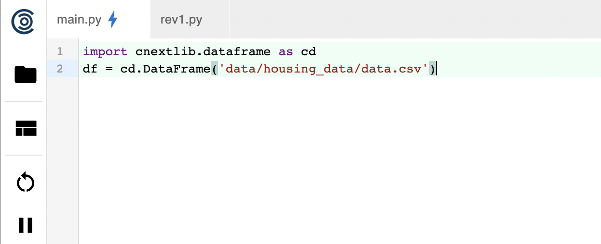

# 🪅 Data Exploration / Profiling

In this page we'll run you through a simple data exploration exercise


### Step 1: Import dataframe

if you downloaded the sample project lets go ahead and pull in a simple dataframe.&#x20;

```python
import cnextlib.dataframe as cd
df = cd.DataFrame('data/housing_data/data.csv')
```

cnextlib is our proprietary wrapper around PANDAS that allows us to do change tracking at the dataframe level. We currently support PANDAS.&#x20;




### Step 2: Data Exploration

Once this cell is run you should see a table updated on the right hand side of the portal with automatic column names.

.png>)

Selecting AutoStats will select the histogram and quantile selections providing a quick graphical overview of each columns’ data.

.png>)

Quantile information can be viewed by changing from Table View to Summary View

.png>)

By default we provide some basic statistics about the data (e.g. count, mean, median, etc)

.png>)

One of the unique aspects of our platform is the ability to query data very quickly and understand what’s in the dataset.

If you switch back to Table View we can play around with some conditional statements to see what’s in this dataset.

When typing in column names we autosuggest column names based on the dataframe.

Let’s look at Lot Frontages > 300 (press Enter after typing in a query)

```python
['LotFrontage'>300]
```

After entering a conditional statement simply press 'Enter' to execute the command.&#x20;

.png>)

Let’s filter down to a few columns

```python
[:,['Alley', 'BldgType', 'HouseStyle']]
```

.png>)

We support compound conditions for data exploration. Try the following code snippet to filter further (be sure to press Enter after inputting the query).

```python
[('Alley' isna)&('LotArea'>8000), ["Alley", 'BldgType', 'HouseStyle', 'LotArea']]
```

.png>)
