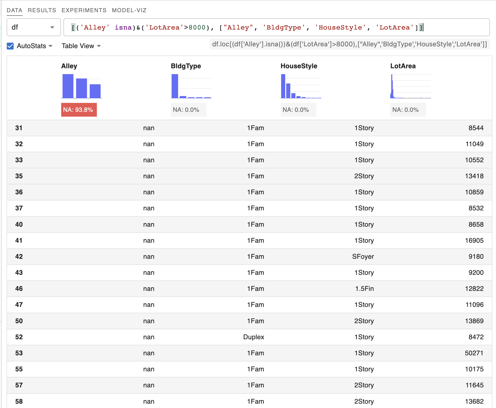

# 🖥 UI Functions

A bit more information around UI settings and functions. Autocompletion, Code Analysis, and Show Markdown are all settings that can be toggled from the bottom left of the UI.

<figure><figcaption></figcaption></figure>

### Autocomplete

Users can toggle the autocomplete functionality in the bottom left hand of the panel. CNext will autosuggest functions, variables and column names (in the right hand pane).&#x20;

.png>).png>)

### Code Analysis

### Show Markdown

